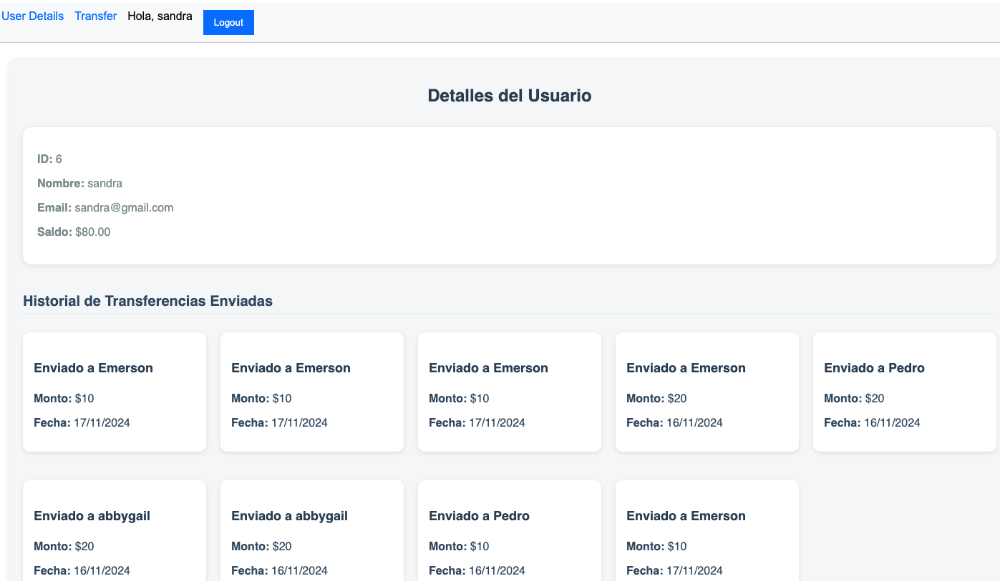
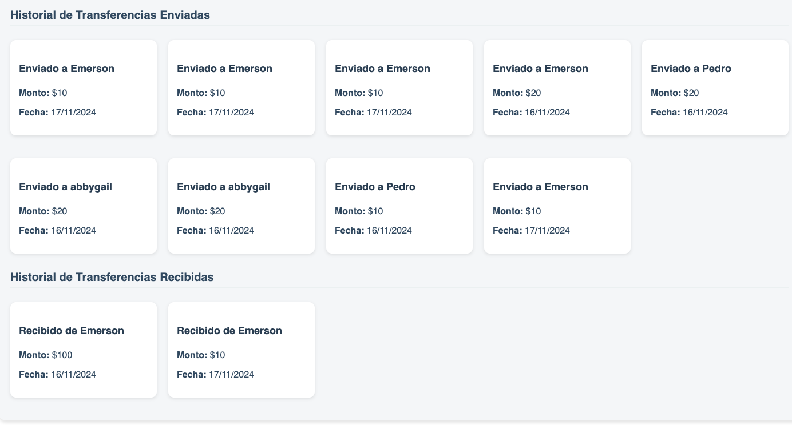
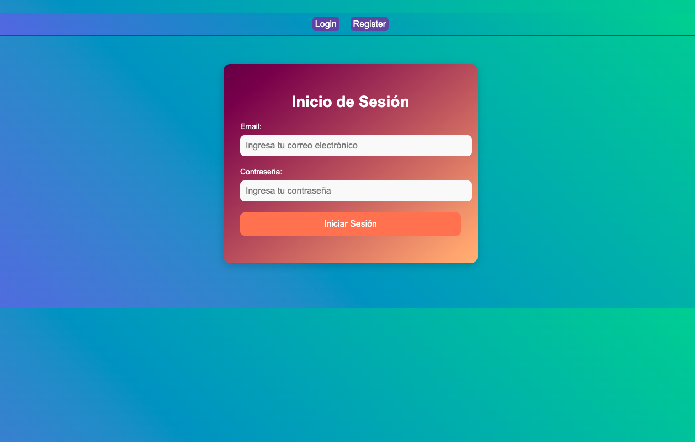
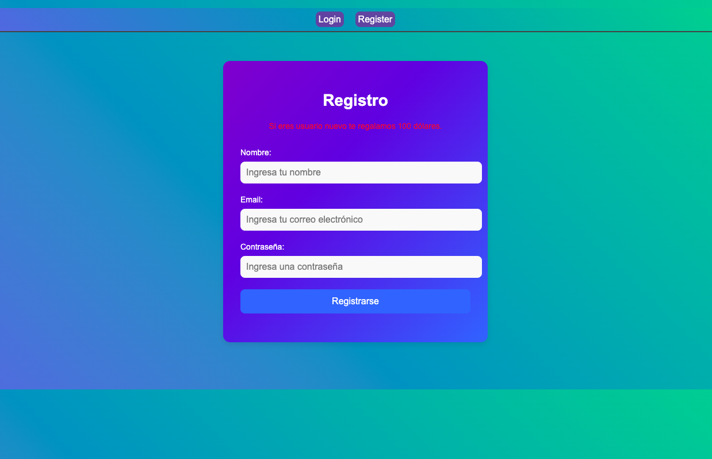
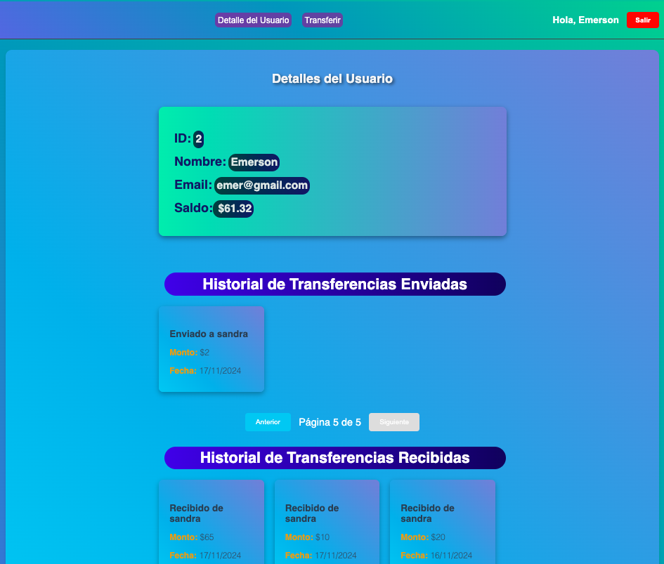
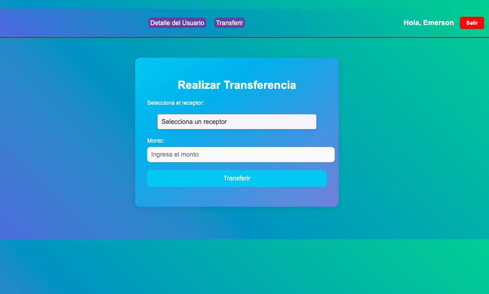
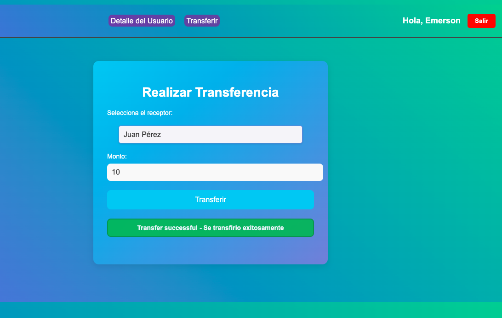
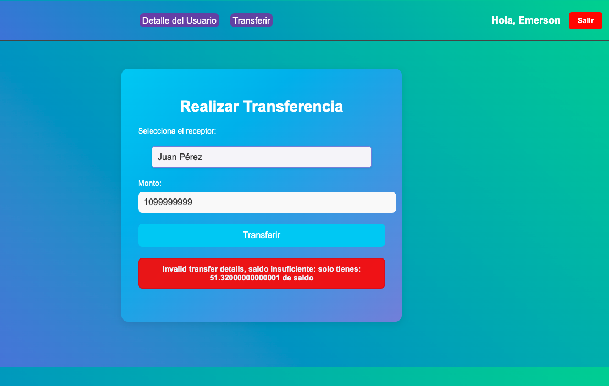
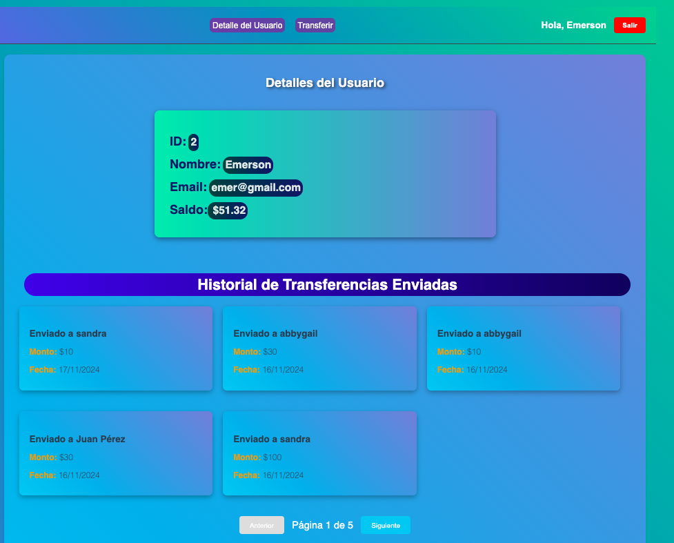

# Frontend de Aplicación de transacciones
- Frontend que consume API realizados con Flask
```bash
```

## conectar  con API - backend desarrollado en flask

crear el proyecto 
```bash
npm create vite
```
- Nombre del proyecto
- Seleccionamos la tecnologia React
- Seleccionamos el lenguaje - javascript
- nos movemos al nombre del proyecto
```bash
cd nombre_proyecto
```
instalamos las dependencias
```bash
npm install 
```
probamos que todo este correcto
```bash
npm run dev
```
## si quieres clonar 
copia el url
```bash
git clone https://github.com/
```
moverse a la carpeta 
```bash
cd nombre_proyecto_creado
```
instalar las dependencias
```bash
npm install
```
correr el proyecto
```bash
npm run dev
```
para agregar nuevas dependencias para conectar API y manejar rutas 
```bash
npm install axios react-router-dom
```
demo versión 1:


demo version 2:
- iniciar sesion

registrarse

Pagina inicial si se logea

Si quiere hacer transferencia

transferencia exitosa

Error de transferencia con saldo insuficiente 

Modificación de datos con transferencias realizadas y recibidas
